<picture>
  <source media="(prefers-reduced-motion: reduce) and (prefers-color-scheme: dark)" srcset="assets/hero-still-dark.svg" />
  <source media="(prefers-reduced-motion: reduce)" srcset="assets/hero-still-light.svg" />
  <source media="(prefers-color-scheme: dark)" srcset="assets/hero-dark.svg" />
  
</picture>

### Websites, AI products & privacy tools.

Founder of [**mokka**](https://mokka-agentur.de). Independent software, made in Germany.

Siegen, DE / web - AI - privacy / palestina libre

---

### Selected work

**[mokka](https://mokka-agentur.de)**

Websites, AI products and automation for small businesses.

Next.js - TypeScript - n8n

 

**[klarbescheid](https://klarbescheid.de)**

AI-assisted checks that make Buergergeld notices easier to understand.

RAG - Qdrant - OCR

 

**[datenmaske](https://datenmaske.de)**

Automatic PDF redaction. Private data stays private.

Python - NER - MuPDF

 

**[Studio Command Center](https://mokka-agentur.de)**

Members, staff, equipment and finances in one studio workspace.

Next.js - Prisma - PostgreSQL

---

### Working with

TypeScript - React - Next.js - Python - FastAPI - PostgreSQL - Docker

RAG - NER - OCR - Qdrant - n8n - Playwright

---

[Let's build something useful ->](https://mokka-agentur.de)
