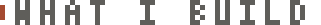
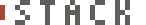

<div align="center">



<picture>
  <source media="(prefers-color-scheme: dark)" srcset="https://readme-typing-svg.demolab.com?font=VT323&size=30&duration=2800&pause=900&color=BCBAB5&center=true&vCenter=true&repeat=true&width=560&height=56&lines=%3E+founder+of+mokka-agentur.de;%3E+building+at+web+%C3%97+ai+%C3%97+privacy;%3E+local+first%2C+always" />
  
</picture>

<br/>

`Siegen, DE` &nbsp;·&nbsp; `palestina libre` &nbsp;·&nbsp; 

<picture>
  <source media="(prefers-color-scheme: dark)" srcset="assets/divider-dark.svg" width="420" />
  
</picture>

</div>

---

<div align="center">

<picture>
  <source media="(prefers-color-scheme: dark)" srcset="assets/hdr-build-dark.svg" />
  
</picture>

</div>

<table>
<tr>
<td width="50%" valign="top">

### <picture><source media="(prefers-color-scheme: dark)" srcset="assets/px-mokka-dark.svg" /></picture> [mokka-agentur.de](https://mokka-agentur.de)
**digital agency — web, AI & automation**

Custom-coded websites (no WordPress), AI products & workflow automation for SMBs across Germany. 100% DSGVO-compliant, German-hosted, load times under 1s.

`next.js` `typescript` `tailwind` `ai-pipelines` `n8n` `stripe`

</td>
<td width="50%" valign="top">

### <picture><source media="(prefers-color-scheme: dark)" srcset="assets/px-klar-dark.svg" /></picture> [klarbescheid.de](https://klarbescheid.de)
**AI-powered Buergergeld notice checker**

Upload a government benefit letter → OCR + semantic search against SGB-II regulations via Qdrant → error detection in under 1 minute. Free for citizens, lawyer partner program.

`rag` `qdrant` `ocr` `langchain` `semantic-search`

</td>
</tr>
<tr>
<td valign="top">

### <picture><source media="(prefers-color-scheme: dark)" srcset="assets/px-mask-dark.svg" /></picture> [datenmaske.de](https://datenmaske.de)
**automatic PDF redaction — DSGVO-compliant SaaS**

Detects 20+ PII types via hybrid NER (spaCy + GLiNER + OpenMed) + regex. Irreversible redaction with pixel-perfect PDF output. Self-hosted models, zero external API calls, EU-only hosting. Free tier without registration.

`ner` `ocr` `mupdf` `pdf-lib` `tesseract` `api`

</td>
<td valign="top">

### <picture><source media="(prefers-color-scheme: dark)" srcset="assets/px-studio-dark.svg" /></picture> [Studio Command Center](https://mokka-agentur.de)
**multi-tenant SaaS for fitness studios**

10-module management platform: inventory, machines, staff, members, finances, course planning & reporting. Multi-tenant architecture, role-based access.

`next.js` `prisma` `clerk` `postgresql` `saas`

</td>
</tr>
</table>

---

<div align="center">

<picture>
  <source media="(prefers-color-scheme: dark)" srcset="assets/hdr-stack-dark.svg" />
  
</picture>

```text
frontend     next.js 14 · react · typescript · tailwind · shadcn/ui
backend      node.js · python · fastapi · prisma · drizzle
cms          directus · strapi · sanity
auth         nextauth · clerk
ai/ml        langchain · RAG · NER (spaCy, GLiNER) · OCR · qdrant · fine-tuning
automation   n8n · make · docker · playwright · puppeteer
payments     stripe api
database     postgresql · redis · qdrant
infrastructure  vercel · german hosting · TLS 1.3 · AES-256
```

<picture>
  <source media="(prefers-color-scheme: dark)" srcset="https://skillicons.dev/icons?i=ts,nextjs,react,tailwind,nodejs,python,docker,postgres,redis,prisma,linux&theme=dark" />
  
</picture>

</div>

---

<div align="center">


</div>

<br/>

<div align="center">

</div>

---

<div align="center">

<picture>
  <source media="(prefers-color-scheme: dark)" srcset="assets/hdr-connect-dark.svg" />
  
</picture>

[**mokka**](https://mokka-agentur.de) · [**klarbescheid**](https://klarbescheid.de) · [**datenmaske**](https://datenmaske.de)

<picture>
  <source media="(prefers-color-scheme: dark)" srcset="assets/divider-dark.svg" width="360" />
  
</picture>

`© gj0xv — all systems local`

</div>
